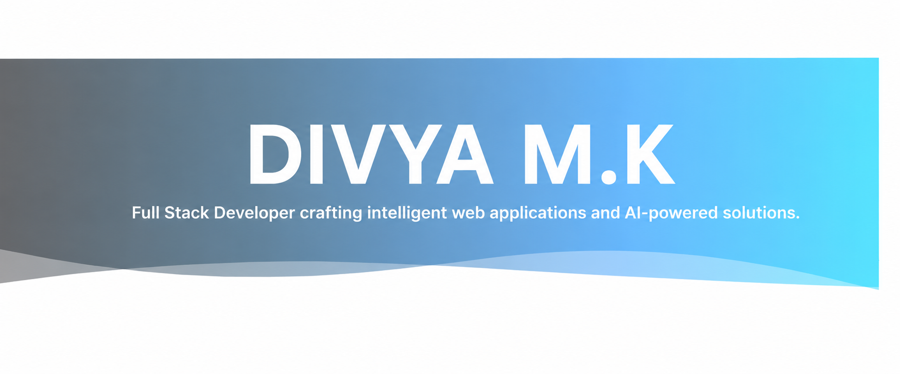

  

<h1 align="center">DIVYA M.K</h1>

<h3 align="center">
Full Stack Developer crafting intelligent web applications and AI-powered solutions.
</h3>

  

## 👩‍💻 About Me

🔥 Passionate Full Stack Developer

🤖 AI & Machine Learning Enthusiast

💻 Building intelligent web applications and software solutions

🚀 Actively participating in hackathons and real-world projects

📚 Constantly learning modern technologies and development practices

🎯 Seeking Software Engineering and Full Stack Development Internship Opportunities

🌱 Focused on Web Development, Artificial Intelligence, Cloud Computing, and System Design

📍 Bengaluru, India

## 🎓 Education

| 🏛 Institute | 📚 Degree | 📍 Location |
|-------------|-----------|-------------|
| HKS International School | Secondary Education | Bengaluru |
| Presidency university  | B.E Computer Science Engineering (Core) | Bengaluru |

🛠️ Technical Skills  
- Programming Languages: Python 
- Web Technologies: HTML, CSS, PHP(Basics)  
- Hardware & IoT:Arduino, Servo Motors  
- Tools & Platforms: Git, GitHub, Kaggle  
- Core Concepts: OOP, Data Structures (Basics), Problem Solving  

 🚀 Projects  
🤖 Arduino-Based Projects  
- Developed Arduino projects involving servo motor control and hardware integration  
- Focused on precision control and efficient C-based programming  

 📊 Kaggle Learning & Practice  
- Completed Kaggle learning modules  
- Practiced Python for data handling and problem-solving  

🏆 Hackathons & Achievements  
- 🏅 Smart India Hackathon (Internal – Software Edition)
  - Participated at Presidency University, Bengaluru  
  - Gained experience in problem-solving, teamwork, and innovation  

- 🥇 Anveshana – State Level Hackathon
  - Selected among 450+ projects
  - Shortlisted in Top 50 projects 

- 🛠️ Arduino Project Winner*
  - Recognized for innovation and practical implementation  

 📜 Certifications  
- Kaggle Python Certification  
- Hackathon Participation Certificates  

 📫 Connect With Me  
- Email: mkdivya054@gmail.com  
- GitHub: https://github.com/Divyamk054  
- LinkedIn: https://www.linkedin.com/in/divyamurthy0124/

⭐ Feel free to explore my repositories and connect with me. I'm always open to learning and collaboration!
